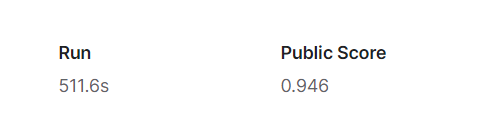
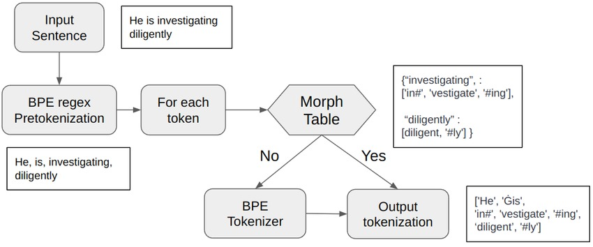

# LLM-Detects-AI-Text

# Final Report: Language Model for Detecting AI Text (LLM)

## Garvit Khurana
### Department of Electrical Engineering
### 22115059

---

## Project Overview

The Large Language Model (LLM) for detecting AI text is a machine learning project capable of distinguishing whether the provided text is generated by some Artificial Intelligence or hand-written. The primary goal was to achieve good accuracy in segmenting the text. I was able to achieve a public score of 0.946.

## Data Analysis

- The very first step was to handle test and train data using the pandas library in Python. An external diverse dataset was imported from Kaggle to train the model.
- Worked with Matplotlib library in Python to depict the dataset in the form of Pie charts and Bar graphs.
- Cleaned the dataset by dropping the duplicate rows in the column named as text.

## Tokenization

- Byte-Pair Encoding Tokenizer was adopted to break our dataset into tokens.
- Converting all text to lowercase and vocabulary size were the techniques used for normalizing.
- Hugging face provided a library named as PreTrainedTokenizerFast from transformers helped in easy and efficient tokenization.

## Vectorization

- TF-IDFVectorizer tool was used to build the TF-IDF matrix from the features extracted using N-gram technique.
- N-gram uses subsequences of N tokens and extracts the features and patterns in the data.

## Models & Classifiers

- Multinomial Naive Bayes Classifier from scikit-learn helped in probabilistic classification based on Bayes Theorem.
- Stochastic Gradient Descent (SGD-Classifier) served the purpose of training our machine learning model in the context of linear classifiers and support vector machines.
- Soft Voting was chosen instead of Hard voting to introduce the concept of weights and its average over all the classes.
- Voting Classifier provided us with a final prediction on the basis of weights of individual models used as mentioned above. Multinomial Naive Bayes was given a weight of 0.9 while Stochastic Gradient Descent Classifier was weighted with 0.91.

Bayes Theorem: \( P(A|B) = \frac{P(B|A) \cdot P(A)}{P(B)} \)

The update step in Stochastic Gradient Descent (SGD) is given by:
\[ \theta_{t+1} = \theta_t - \eta \nabla J(\theta_t;x_i, y_i) \]

The cost function \(J(\theta_t; x_i, y_i)\) for linear regression is given by:
\[ J(\theta_t; x_i, y_i) = \frac{1}{2}(h_{\theta_t}(x_i) - y_i)^2 \]

## Challenges

- Getting a score of greater than 0.9 was a challenging task. To do so I changed weights of voting and used only two models: naive bayes and stochastic gradient descent.
- Understanding the mathematics behind the classifiers was a time-consuming work and faced difficulty in grasping them.

## Conclusion

The LLM project has made significant strides in developing a language model for detecting AI-generated text. While encountering challenges, the project remains on track for achieving its objectives. The incorporation of mathematical components and diverse technologies ensures a comprehensive approach to text detection.
